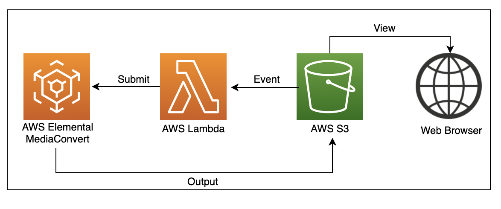
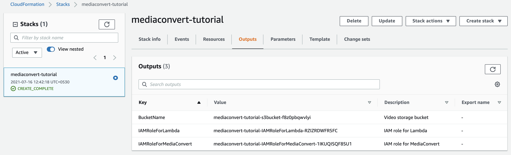

## AWS Elemental Mediaconvert

**Introduction**

- AWS Elemental MediaConvert is a file-based video transcoding service with broadcast-grade functionality. It offers to easily generate on-demand video (VOD) content for transmit and multiscreen distribution at a larger scale. 
- The service concat advanced video and audio functionality via an UI with pay-as-you-go pricing. This service also allow on delivering compelling media experiences without having to worry about the criticality of building and operating your own video processing infrastructure.
- Below are the different features of AWS Elemental Mediaconvert

  - Broadcast Capabilities for Video-on-Demand Content
  
  - Comprehensive Input and Output Support
  
  - Automated Resource Provisioning
  
  - Built-in Reliability
  
  - Pay-as-you-go pricing

**MediaConvert components**

  - Jobs: A job performs the task of transcoding. When we configure a job, specify the name of the file that we want to transcode, the name we want MediaConvert to provide to the finished output files, and other configuration

  - Queues: A queue provide to control the resources that are available to the AWS account for parallel processing

  - Presets: A preset is a persisted group of encoding configurations for an output. We can create many such outputs by simply choosing a system preset

  - Job templates: A job template cpntains all the configurations for an end to end job, excluding IAM role and settings like the input file location and name, and user metadata that we might tag the job with.

**Demo**

- Now we will learn how to leverage MediaConvert to configure jobs using AWS Lambda in an automation fashion

  

- Steps to implement to MediaConvert jobs

  - Step 1: Prerequisite  

    -  Download the <a href="https://github.com/sanchitdilipjain/aws-elemental-mediaconvert/blob/main/prerequisite-cft.json">cloudformation template</a> from this link and Deploy it

    -  Once the Cloudformation stack is deployed successfully please capture the values for BucketName, IAMRoleForLambda and IAMRoleForMediaConvert from the Output Section of stack
       
        

        
    -  Download the <a href="https://github.com/sanchitdilipjain/aws-elemental-mediaconvert/blob/main/sample-audio/sample-audio.m2ts">Sample Audio</a> from this link and upload it to the S3 bucket
    
    -  Download the <a href="https://github.com/sanchitdilipjain/aws-elemental-mediaconvert/blob/main/job_template.json">MediaConvert Job Template</a> from this link
  
  - Step 2: Execution via AWS console

  - Step 3: Automatation via AWS Lambda

