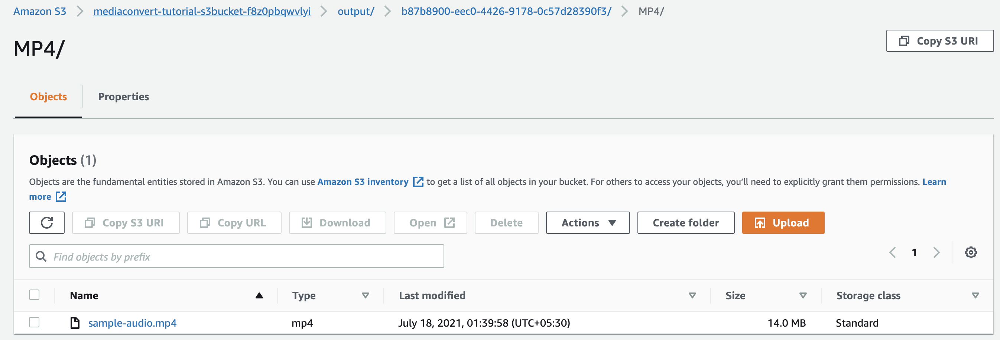

## AWS Elemental Mediaconvert

**Introduction**

- AWS Elemental MediaConvert is a file-based video transcoding service with broadcast-grade functionality. It offers to easily generate on-demand video (VOD) content for transmitting and multiscreen distribution at a larger scale. 
- The service merges advanced video and audio functionality via a UI with pay-as-you-go pricing. This service also allows for delivering compelling media experiences without having to worry about the criticality of building and operating your own video processing infrastructure.
- Below are the different features of AWS Elemental Mediaconvert

  - Broadcast Capabilities for Video-on-Demand Content
  
  - Comprehensive Input and Output Support
  
  - Automated Resource Provisioning
  
  - Built-in Reliability
  
  - Pay-as-you-go pricing

**MediaConvert components**

  - Jobs: A job performs the task of transcoding. When we configure a job, specify the name of the file that we want to transcode, the name we want MediaConvert to provide to the finished output files, and other configuration

  - Queues: A queue provide to control the resources that are available to the AWS account for parallel processing

  - Presets: A preset is a persisted group of encoding configurations for an output. We can create many such outputs by simply choosing a system preset

  - Job templates: A job template contains all the configurations for an end-to-end job, excluding IAM role and settings like the input file location and name, and user metadata that we might tag the job with.

**Demo**

- Now we will learn how to leverage MediaConvert to configure jobs using AWS Lambda in an automation fashion

  

- Steps to implement to MediaConvert jobs

  - Step 1: Prerequisite  

    -  Download the <a href="https://github.com/sanchitdilipjain/aws-elemental-mediaconvert/blob/main/prerequisite-cft.json">cloudformation template</a> from this link and Deploy it

    -  Once the Cloudformation stack is deployed successfully please capture the values for BucketName, IAMRoleForLambda, and IAMRoleForMediaConvert from the Output Section of the stack
       
        

        
    -  Download the <a href="https://github.com/sanchitdilipjain/aws-elemental-mediaconvert/blob/main/sample-audio/sample-audio.m2ts">Sample Audio</a> from this link and upload it to the S3 bucket
  
  - Step 2: Execution via AWS console
  
    - Open the AWS MediaConvert console at<a href="https://console.aws.amazon.com/mediaconvert/"> link </a>
    
    - Click on get started from the home page
    
    - Choose Input 1 from the left navigation panel under Inputs and provide Input file S3 location under Input 1
      
      

      
      

    
    - Choose Output Groups from the left navigation panel and click Add
    
    - Check the File group box then click on Select
    
      

      
    - Next, provide a name to the File group and provide an S3 output location. And leave the remaining settings as the default
    
      

      
    - Now click on H.264, AAC under Output section to provide Output configuration
    
      - Under the Encoding settings panel enter 1280 and 720 in the Resolution box (w x h)

      - Ensure Rate control mode is selected to QVBR and enter 3000000 for the Max birate (bit/s)

      - Leave all other settings for Output 1 as the default
      
        

    
    - Choose the AWS Integration under Job settings section from the left navigation panel
    
      - Provide IAM role detail under the Service access

      - Select Use an existing role and then select the role starting with mediaconvert-tutorial-xxx-xx 
      
        

      
        **Note:** This IAMRole should be the same as the IAMRoleForMediaConvert which we deployed via Cloudformation stack under the Prerequisite section
     
    - Finally, scroll to the bottom of the page and click Create
        
        - Once the job is submitted 
          
          

        - Post the job is completed 
          
          

          
     - Let's verify the output from the S3 location provide under the output section  
     
          

          
          

 
     - At last, we will export the job as a json file from the Job summary console so we can execute the same via Lambda in an automated fashion
     
          

  - Step 3: Automatation via AWS Lambda
  
    - Download the <a href="https://github.com/sanchitdilipjain/aws-elemental-mediaconvert/blob/main/job_template.json">MediaConvert Job Template</a> from this link
    
    - Download the <a href="https://github.com/sanchitdilipjain/aws-elemental-mediaconvert/blob/main/MediConvert-Lambda.py">Lambda code for MediaConvert Job</a> from this link  
    
    - Deploy Lambda from the code we downloaded above and provide IAMRoleForLambda which we deployed via Cloudformation stack under the Prerequisite section
      
      

      
      

      
      

    
    - Now we will test the Lambda, choose the S3 Put event from the list of samples and update the S3 bucket and S3 key details. After changes in the event json save it.
    
      

    
    - Now click Test and provide event json we saved above and wait for the result
    
      - Lambda output
        
        

      
      - S3 bucket output
      
        

